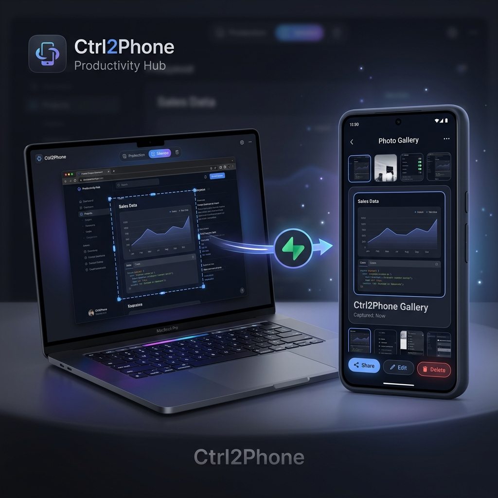

<div align="center">

# ⌨️ Ctrl2Phone

**Double-tap Ctrl → Select area → Send to Gemini or your Phone | + Universal Clipboard Syncing**

*Çift Ctrl → Alan seç → Gemini'a veya Telefonuna gönder | + Evrensel Pano Senkronizasyonu*

[](LICENSE)
[](https://www.electronjs.org/)
[](https://flutter.dev/)
[](https://supabase.com/)

<br>


</div>

---


## 🇬🇧 English

### What is Ctrl2Phone?

Ctrl2Phone is an open-source desktop + mobile system that lets you:

1. **Double-tap Left Ctrl** to freeze your screen
2. **Draw a selection** with your mouse
3. **Press X** → Paste it directly into Gemini Web
4. **Press M** → Send it to your phone's gallery via Supabase
5. **Press Ctrl + Shift + V** (Desktop) or tap **FAB** (Mobile) → Sync your clipboard/links instantly across device panos!

No cloud accounts needed on our side — **you bring your own Supabase** (free tier works perfectly).

### ✨ Features

| Feature | Description |
|---|---|
| 🖥️ **Instant Screen Freeze** | Double Ctrl captures your display in <30ms (RAM-based, no disk write) |
| ✂️ **Pixel-Perfect Selection** | Draw any rectangle, multi-monitor aware |
| 🤖 **Gemini Integration** | Press X to paste selection directly into Gemini Web |
| 📱 **Phone Sync** | Press M to upload to Supabase → open mobile app → image in your gallery |
| 📋 **Universal Clipboard** | Sync text and links instantly. Robust 1.5s polling loop with duplicate-protection algorithms |
| 📷 **QR Setup** | Scan QR code from desktop app to configure mobile app instantly |
| 🔒 **Privacy First** | Your keys, your storage. No third-party servers. Fully open source |
| 🎯 **Smart Key Blocking** | Hotkeys only intercept when selection overlay is active (won't mute YouTube!) |
| 🖼️ **Lossless PNG** | Screenshots uploaded in full PNG quality |

### 🏗️ Architecture

```
┌──────────────────┐     ┌──────────────────┐     ┌──────────────────┐
│   Desktop App    │     │     Supabase     │     │   Mobile App     │
│   (Electron)     │────▶│ • Storage Bucket │◀────│   (Flutter)      │
│                  │     │ • Database Table │     │                  │
│ • C# Key Hook    │     │   (clipboard_sync│     │ • QR Scanner     │
│ • Screen Capture │     └──────────────────┘     │ • Gallery Save   │
│ • Clipboard Poll │              ▲               │ • Clipboard Poll │
└──────────────────┘              │               └──────────────────┘
                                  ▼
                        ┌──────────────────┐
                        │  Window DPAPI    │
                        │  (SafeStorage)   │
                        └──────────────────┘
```

### 📥 Downloads

You can download the pre-compiled installer for Windows (`.exe`) and the Android application (`.apk`) directly from Google Drive:
👉 **[Download Ctrl2Phone (Windows & Android)](https://drive.google.com/drive/u/0/folders/1ux5WS0Wt8KEGsiJrXqTOhdoDFR1wMANM)**

### 🚀 Quick Start

#### Desktop App

```bash
# Clone the repo
git clone https://github.com/1lord0/ctrl2phone.git
cd ctrl2phone/desktop

# Install dependencies
npm install

# Run
npm start
```

1. Enter your **Supabase URL**, **Anon Key**, and **Bucket Name** in the settings panel
2. Click **"Ayarları kaydet"** (Save Settings)
3. Double-tap **Left Ctrl** anywhere → draw selection → **X** (Gemini) or **M** (Phone)

#### Mobile App (Flutter)

```bash
cd ctrl2phone/mobile
flutter pub get
flutter run
```

1. Open the app → tap **QR Scan** in settings
2. Scan the QR code shown on the desktop app
3. Browse and download your screenshots to your gallery

### ⌨️ Keyboard Shortcuts

| Shortcut | Action | Location |
|---|---|---|
| `Ctrl` `Ctrl` (double tap) | Open selection overlay | Everywhere |
| `Ctrl` + `Shift` + `V` | Sync desktop clipboard to mobile | Everywhere |
| `X` or `Enter` | Send selection to Gemini Web | Selection Overlay |
| `M` | Upload selection to Supabase (→ Phone) | Selection Overlay |
| `Esc` | Cancel selection | Selection Overlay |
| `Q` | Quit application | Selection Overlay |

### 📋 Prerequisites

- **Node.js** 18+ and **npm**
- **Windows 10/11** (C# key listener is Windows-only)
- **Supabase** account (free tier: [supabase.com](https://supabase.com))
- **Flutter** 3.x (for mobile app)

### 🔨 Building the C# Key Listener

The global hotkey listener is a small C# Windows app that must be compiled before running:

```powershell
# From the desktop/src directory
cd ctrl2phone/desktop/src

# Using csc (C# compiler) — included with Windows SDK or Visual Studio
csc /target:winexe /out:key_listener.exe key_listener.cs

# Or using dotnet CLI (if you have .NET SDK installed)
dotnet build -c Release -o . key_listener.cs
```

> ⚠️ **Do not commit `key_listener.exe` to Git.** It is already listed in `.gitignore`.

### 🔧 Supabase Setup

1. Create a new project at [supabase.com](https://supabase.com)
2. Go to **Storage** → Create a new bucket (e.g., `screenshots`)
3. Set the bucket to **Public**
4. Go to **SQL Editor** and run the following script to create the Clipboard sync table:
   ```sql
   CREATE TABLE clipboard_sync (
     id UUID DEFAULT gen_random_uuid() PRIMARY KEY,
     content TEXT NOT NULL,
     source TEXT NOT NULL CHECK (source IN ('desktop', 'mobile')),
     created_at TIMESTAMPTZ DEFAULT NOW()
   );

   -- Enable Row Level Security
   ALTER TABLE clipboard_sync ENABLE ROW LEVEL SECURITY;

   -- Create policy to allow all actions for anonymous access
   CREATE POLICY "Allow all" ON clipboard_sync FOR ALL USING (true) WITH CHECK (true);
   ```
5. Copy your **Project URL** and **anon key** from Settings → API
6. Paste them into the Ctrl2Phone desktop app

### 🔒 Security Notes

- **Use your Supabase Anon Key**, not the Service Key. The Service Key bypasses Row Level Security (RLS) and should never be distributed in client applications.
- Make sure your Supabase Storage bucket has **RLS policies enabled** for anonymous uploads. See [Supabase RLS docs](https://supabase.com/docs/guides/storage/security/access-control) for setup.

---

## 🇹🇷 Türkçe

### Ctrl2Phone Nedir?

Ctrl2Phone, masaüstünden ekran görüntüsü alıp **Gemini Web**'e yapıştırmanı, tek tuşla **telefonunun galerisine** göndermeni veya **cihazlar arası panolarını (metin ve linkler)** anında senkronize etmeni sağlayan açık kaynak bir sistemdir.

### ✨ Özellikler

- ⌨️ **Çift Ctrl** ile ekranı dondur, fareyle alan seç
- 🤖 **X tuşu** ile seçimi Gemini Web'e yapıştır
- 📱 **M tuşu** ile seçimi Supabase üzerinden telefonuna gönder
- 📋 **Evrensel Pano**: Bilgisayarda kopyalanan metni telefon panosuna, telefonda kopyalananı bilgisayar panosuna anında aktar. Çift kopyalama kilitlenmelerini engelleyen `lastProcessedClipboardId` algoritması ve arka plan bağlantı korumalı 1.5s periyodik sorgulama (polling) mimarisi.
- 📷 **QR Kod** ile mobil uygulamayı anında bağla
- 🔒 **Gizlilik**: Kendi Supabase hesabın, kendi anahtarların. Üçüncü parti sunucu yok
- 🖼️ **Kayıpsız PNG** kalitesinde ekran görüntüsü
- 🎯 **Akıllı Tuş Engelleme**: Kısayollar sadece seçim modu açıkken çalışır

### 📥 İndir (Hazır Kurulum)

Windows kurulum programını (`.exe`) ve Android uygulamasını (`.apk`) doğrudan Google Drive üzerinden indirebilirsiniz:
👉 **[Ctrl2Phone İndir (Windows & Android)](https://drive.google.com/drive/u/0/folders/1ux5WS0Wt8KEGsiJrXqTOhdoDFR1wMANM)**

### 🚀 Hızlı Başlangıç

#### Masaüstü Uygulaması

```bash
git clone https://github.com/1lord0/ctrl2phone.git
cd ctrl2phone/desktop
npm install
npm start
```

1. Ayarlar panelinden **Supabase URL**, **Anon Key** ve **Bucket Name** girin
2. **"Ayarları kaydet"** butonuna tıklayın
3. Herhangi bir yerde **sol Ctrl'e iki kere** basın → alan seçin → **X** (Gemini) veya **M** (Telefon)

#### Mobil Uygulama (Flutter — Android & iOS)

```bash
cd ctrl2phone/mobile
flutter pub get
```

**Android:**
```bash
flutter run
```

**iOS (macOS + Xcode gerektirir):**
```bash
cd ios
pod install
cd ..
flutter run
```

> **iOS Release Build:** Code signing gereklidir. `flutter build ipa --release` komutunu kullanmadan önce Apple Developer hesabı, sertifika ve provisioning profile ayarlamalısınız. Detaylar için [Flutter iOS deployment docs](https://docs.flutter.dev/deployment/ios) bakın.

1. Uygulamayı açın → Ayarlar'dan **QR Tara** butonuna dokunun
2. Masaüstü uygulamasında görünen QR kodu tarayın
3. Ekran görüntülerinizi galerinize indirin

### 🔧 Supabase Kurulumu

1. [supabase.com](https://supabase.com) adresinde yeni proje oluşturun (ücretsiz)
2. **Storage** → Yeni bucket oluşturun (örn: `screenshots`)
3. Bucket'ı **Public** yapın
4. **SQL Editor** sayfasına gidin ve aşağıdaki script'i çalıştırarak pano tablosunu oluşturun:
   ```sql
   CREATE TABLE clipboard_sync (
     id UUID DEFAULT gen_random_uuid() PRIMARY KEY,
     content TEXT NOT NULL,
     source TEXT NOT NULL CHECK (source IN ('desktop', 'mobile')),
     created_at TIMESTAMPTZ DEFAULT NOW()
   );

   -- Row Level Security Etkinleştir
   ALTER TABLE clipboard_sync ENABLE ROW LEVEL SECURITY;

   -- Herkesin işlem yapabilmesi için politika oluştur
   CREATE POLICY "Allow all" ON clipboard_sync FOR ALL USING (true) WITH CHECK (true);
   ```
5. Settings → API'den **Project URL** ve **anon key** değerlerini kopyalayın
6. Ctrl2Phone masaüstü uygulamasına yapıştırın

### 🔨 C# Key Listener Derleme

Global kısayol dinleyicisi, çalıştırılmadan önce derlenmesi gereken küçük bir C# Windows uygulamasıdır:

```powershell
cd ctrl2phone/desktop/src

# csc kullanarak (Windows SDK veya Visual Studio ile gelir)
csc /target:winexe /out:key_listener.exe key_listener.cs

# veya dotnet CLI ile (.NET SDK kuruluysa)
dotnet build -c Release -o . key_listener.cs
```

> ⚠️ **`key_listener.exe`'yi Git'e commit etmeyin.** `.gitignore`'da zaten listelenmiştir.

### 🔒 Güvenlik Notları

- **Supabase Service Key yerine Anon Key kullanın.** Service Key, Row Level Security (RLS) kurallarını bypass eder ve client uygulamalarda asla kullanılmamalıdır.
- Supabase Storage bucket'ınızda anonim yükleme için **RLS politikaları** aktif olduğundan emin olun. Detaylar için [Supabase RLS dokümanlarına](https://supabase.com/docs/guides/storage/security/access-control) bakın.

---

## 🛠️ Tech Stack

| Component | Technology |
|---|---|
| Desktop App | Electron.js |
| Global Hotkeys | C# (Low-level keyboard hook) |
| Screen Capture | `screenshot-desktop` (native) |
| Cloud Storage | Supabase Storage & Database |
| Mobile App | Flutter + Dart |
| QR Generation | `qrcode` (Node.js) |

## 📁 Project Structure

```
ctrl2phone/
├── desktop/                # Electron desktop app
│   ├── src/
│   │   ├── main.ts         # Main process (capture, upload, hotkeys, polling)
│   │   ├── preload.ts      # IPC bridge
│   │   ├── renderer.ts     # UI logic
│   │   ├── overlay.js      # Selection overlay logic (JS)
│   │   ├── overlay.html    # Overlay window
│   │   ├── overlay.css     # Overlay styles
│   │   ├── styles.css      # Main window styles
│   │   ├── key_listener.cs # C# global keyboard hook source
│   │   └── key_listener.exe# Build from source (see instructions above)
│   ├── index.html          # Main window
│   └── package.json
├── mobile/                 # Flutter mobile app
│   └── ...
├── LICENSE
└── README.md
```

## 🤝 Contributing

Contributions are welcome! Feel free to:

1. Fork the repository
2. Create a feature branch (`git checkout -b feature/amazing-feature`)
3. Commit your changes (`git commit -m 'Add amazing feature'`)
4. Push to the branch (`git push origin feature/amazing-feature`)
5. Open a Pull Request

## 📄 License

This project is licensed under the MIT License - see the [LICENSE](LICENSE) file for details.

---

<div align="center">

**Made with ❤️ by [Eren](https://github.com/1lord0)**

⭐ Star this repo if you find it useful!

</div>
