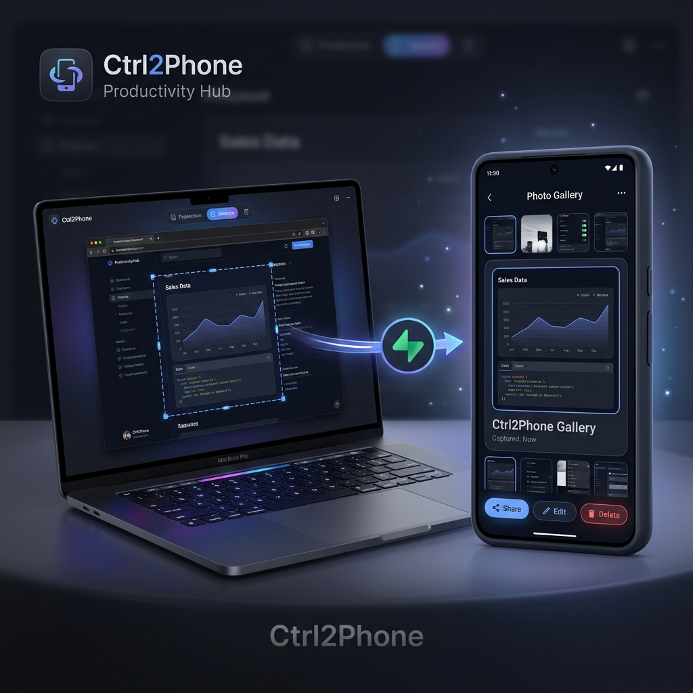

<div align="center">

# ⌨️ Ctrl2Phone

**Double-tap Ctrl → Select area → Send to Gemini or your Phone**

*Çift Ctrl → Alan seç → Gemini'a veya Telefonuna gönder*

[](LICENSE)
[](https://www.electronjs.org/)
[](https://flutter.dev/)
[](https://supabase.com/)

<br>


</div>

---


## 🇬🇧 English

### What is Ctrl2Phone?

Ctrl2Phone is an open-source desktop + mobile system that lets you:

1. **Double-tap Left Ctrl** to freeze your screen
2. **Draw a selection** with your mouse
3. **Press X** → Paste it directly into Gemini Web
4. **Press M** → Send it to your phone's gallery via Supabase

No cloud accounts needed on our side — **you bring your own Supabase** (free tier works perfectly).

### ✨ Features

| Feature | Description |
|---|---|
| 🖥️ **Instant Screen Freeze** | Double Ctrl captures your display in <30ms (RAM-based, no disk write) |
| ✂️ **Pixel-Perfect Selection** | Draw any rectangle, multi-monitor aware |
| 🤖 **Multi-provider AI** | Press X to send the selection to Gemini, Claude, OpenAI or a local model — or paste into Gemini Web (default, no key needed) |
| 📱 **Phone Sync** | Press M to upload to Supabase → open mobile app → image in your gallery |
| 📋 **Universal Clipboard** | Sync clipboard text/links bidirectionally: PC-to-Phone (Ctrl+Shift+V / button) and Phone-to-PC (FAB button) |
| 📷 **QR Setup** | Scan QR code from desktop app to configure mobile app instantly |
| 🔒 **Privacy First** | Your keys, your storage. No third-party servers. Fully open source |
| 🌐 **English / Türkçe UI** | Interface language follows your OS by default; switch EN/TR in settings |
| 🎯 **Smart Key Blocking** | Hotkeys only intercept when selection overlay is active (won't mute YouTube!) |
| 🖼️ **Lossless PNG** | Screenshots uploaded in full PNG quality |

### 🏗️ Architecture

```
┌──────────────────┐     ┌──────────────────┐     ┌──────────────────┐
│   Desktop App    │     │     Supabase      │     │   Mobile App     │
│   (Electron)     │────▶│   Storage Bucket  │◀────│   (Flutter)      │
│                  │     │                   │     │                  │
│ • C# Key Hook   │     │ • PNG files       │     │ • QR Scanner     │
│ • Screen Capture │     │ • Signed URLs     │     │ • Gallery Save   │
│ • Gemini Paste   │     │ • Free tier OK    │     │ • Auto Download  │
└──────────────────┘     └──────────────────┘     └──────────────────┘
```

### 🚀 Quick Start

#### Desktop App

```bash
# Clone the repo
git clone https://github.com/1lord0/ctrl2phone.git
cd ctrl2phone/desktop

# Install the locked dependency tree
npm ci

# Run
npm start
```

To run the same checks used by Desktop CI (run the native-helper steps on
Windows), use these exact commands from `ctrl2phone/desktop`:

```bash
npm ci
npm run typecheck
npm run lint
npm run format:check
npm run build:native
npm test -- --runInBand
npm audit --omit=dev --audit-level=high
npm run build
npm run package
```

`npm start` runs the TypeScript build, native-helper build, and Electron app
in one command. `npm run package` writes the installer artifacts to
`desktop/dist/`.

1. Enter your **Supabase URL**, **Anon Key**, and **Bucket Name** in the settings panel
2. Click **"Ayarları kaydet"** (Save Settings)
3. Double-tap **Left Ctrl** anywhere → draw selection → **X** (Gemini) or **M** (Phone)

#### Mobile App (Flutter)

```bash
cd ctrl2phone/mobile
flutter pub get
flutter run
```

1. Open the app → tap **QR Scan** in settings
2. Scan the QR code shown on the desktop app
3. Browse and download your screenshots to your gallery

### ⌨️ Keyboard Shortcuts

| Shortcut | Action |
|---|---|
| `Ctrl` `Ctrl` (double tap) | Open selection overlay |
| `X` or `Enter` | Send selection to your AI provider (Gemini web by default; or Gemini/Claude/OpenAI/local API with the reply shown in-app) |
| `M` | Upload selection to Supabase (→ Phone) |
| `Ctrl + Shift + V` | Send your PC clipboard text/link to your phone instantly (works globally) |
| `Esc` | Cancel selection |
| `Q` | Quit application |

> The **trigger key** (Left Ctrl by default — choose Left/Right Ctrl, Alt or Shift) and the **double-tap window** (ms) are configurable in the desktop app settings.

### 🤖 AI Providers

Pressing **X** sends the selected region to whichever backend you pick in **Settings → AI provider**:

| Provider | Needs a key? | Notes |
|---|---|---|
| **Gemini (web)** | No | Default. Pastes the crop into `gemini.google.com` in a built-in window |
| **Gemini API** | Yes | Google AI Studio key; reply shown in-app |
| **Claude API** | Yes | Anthropic key; defaults to `claude-opus-4-8`, reply shown in-app |
| **OpenAI API** | Yes | OpenAI key; defaults to `gpt-4o`, reply shown in-app |
| **Custom (OpenAI-compatible)** | Optional | Point the **base URL** at a local server (Ollama, LM Studio) or a gateway (OpenRouter) |

Your API key is stored **encrypted on your device** (Electron `safeStorage`) and is sent only to the provider you choose. With any API provider the model's reply appears directly in the app's response pane — no browser needed. The prompt note (top of settings) is sent alongside the image.

### 📦 Desktop output and preload boundaries

TypeScript sources live under `desktop/src/`. `npm run build` compiles them to
`desktop/dist/js/` (the generated JavaScript and source maps are not hand-edited
or committed). `npm run package` places the Electron installer and portable
artifacts in `desktop/dist/` alongside that compiled output.

Each Electron window receives only the bridge it needs:

- `src/preload-main.ts` — the main panel/pill window bridge.
- `src/preload-overlay.ts` — the selection overlay bridge.
- `src/preload-notification.ts` — the phone-sync notification bridge.

All three use context isolation with Node integration disabled; renderer code
does not receive a broad Node or IPC surface.

### 📋 Prerequisites

- **Node.js** 18+ and **npm**
- **Windows 10/11** (C# key listener is Windows-only)
- **Supabase** account (free tier: [supabase.com](https://supabase.com))
- **Flutter** 3.x (for mobile app)

### 🔨 Building the Windows helpers

The desktop runtime uses four small native Windows executables. They are
compiled from the C# sources in `desktop/src/`:

| Helper | Role |
|---|---|
| `key_listener.exe` | Global double-Ctrl hotkey listener |
| `pill_hud.exe` | Native floating pill HUD |
| `round_window.exe` | Applies the native rounded/transparent window shape |
| `photo_dropper.exe` | Floating drag-and-drop panel for phone→PC files |

From the desktop directory, compile all four with the repository script (it
adds the required Windows Forms and Drawing references):

```powershell
cd ctrl2phone/desktop
npm run build:native
```

If `photo_dropper.exe` is unavailable, phone→PC sync still copies an image to
the clipboard, but the drag-and-drop panel cannot appear. The generated
executables are ignored by Git and should not be committed.

### 🔒 Security Notes

- **Use your Supabase Anon Key**, never the Service Key. The Service Key bypasses Row Level Security (RLS) and must never be put into a client app or a QR code.
- **The anon key is a bearer capability for your dedicated Ctrl2Phone project.** Any paired client—or anyone who obtains that key—can select/delete clipboard rows and access bucket objects allowed by the generated policies. Rotate the key and re-pair after suspected exposure.
- **Run the one-time security setup.** In the desktop app click the **🔒 Secure Setup (RLS)** button (labeled *"Güvenli Kurulum…"*): it copies a SQL snippet and opens your Supabase SQL Editor — paste it and press **Run**. It makes your bucket **private** and scopes the anon key to *only* that bucket.
- The same setup creates the RLS-protected `clipboard_sync` table. Clipboard payloads are limited to **10,000 Unicode characters** and paired clients receive SELECT, INSERT, and DELETE access only; UPDATE is not granted.
- The app reads images through **short-lived signed URLs** (not permanent public links), so the gallery keeps working after the bucket is private, and there is no forever-public handle to your screenshots. Filenames are random UUIDs, so they can't be enumerated.
- ⚠️ **Until you run the setup SQL the bucket is PUBLIC** — anyone who learns your project URL + bucket name can read every screenshot. Treat the pairing QR code (which carries your anon key) like a password.
- 📄 For assets, trust boundaries, attacker scenarios and residual risks, see the [**Threat Model**](docs/THREAT_MODEL.md).

<details><summary>The SQL the button runs (for bucket <code>screenshots</code>)</summary>

```sql
create table if not exists public.clipboard_sync (
  id uuid primary key default gen_random_uuid(),
  content text not null,
  source text not null check (source in ('desktop', 'mobile')),
  created_at timestamptz not null default now(),
  check (char_length(content) between 1 and 10000)
);
create index if not exists clipboard_sync_source_created_at_idx
  on public.clipboard_sync (source, created_at asc);
alter table public.clipboard_sync enable row level security;
revoke all on table public.clipboard_sync from anon, authenticated;
grant select, insert, delete on table public.clipboard_sync to anon, authenticated;

create policy "ctrl2phone_clipboard_select" on public.clipboard_sync
  for select to anon, authenticated using (true);
create policy "ctrl2phone_clipboard_insert" on public.clipboard_sync
  for insert to anon, authenticated with check (
    source in ('desktop', 'mobile') and char_length(content) between 1 and 10000
  );
create policy "ctrl2phone_clipboard_delete" on public.clipboard_sync
  for delete to anon, authenticated using (true);

update storage.buckets set public = false where name = 'screenshots';

create policy "ctrl2phone_select_screenshots" on storage.objects
  for select to anon, authenticated using (bucket_id = 'screenshots');
create policy "ctrl2phone_insert_screenshots" on storage.objects
  for insert to anon, authenticated with check (bucket_id = 'screenshots');
create policy "ctrl2phone_update_screenshots" on storage.objects
  for update to anon, authenticated using (bucket_id = 'screenshots') with check (bucket_id = 'screenshots');
create policy "ctrl2phone_delete_screenshots" on storage.objects
  for delete to anon, authenticated using (bucket_id = 'screenshots');

-- Realtime push (instant phone↔PC sync instead of polling) — best-effort.
-- 'storage' is a private schema, so anon needs a table GRANT (not just RLS) to
-- receive change events. Both steps are non-fatal: if your role lacks permission
-- they're skipped (NOTICE) without rolling back the policies above — enable
-- storage.objects under Database → Publications in the dashboard instead.
do $$ begin
  grant select on storage.objects to anon, authenticated;
exception when others then raise notice 'grant skipped: %', sqlerrm; end $$;
do $$ begin
  alter publication supabase_realtime add table storage.objects;
exception when others then raise notice 'publication skipped: %', sqlerrm; end $$;
```
The in-app button generates this for *your* actual bucket name. See [Supabase Storage access control](https://supabase.com/docs/guides/storage/security/access-control).
</details>

### 🔧 Supabase Setup

1. Create a new project at [supabase.com](https://supabase.com)
2. Go to **Storage** → Create a new bucket (e.g., `screenshots`)
3. Copy your **Project URL** and **anon key** from Settings → API
4. Paste them into the Ctrl2Phone desktop app and click **Save settings**
5. Click **🔒 Secure Setup (RLS)** and run the SQL it copies — this creates and protects `clipboard_sync`, makes the bucket **private**, and grants the paired clients only the required operations (see [Security Notes](#-security-notes))

> ⚠️ Older versions told you to make the bucket **Public**. Don't — run the Secure Setup instead. The app reads images through short-lived **signed URLs**, so a private bucket works end-to-end and your screenshots are never world-readable.

---

## 🇹🇷 Türkçe

### Ctrl2Phone Nedir?

Ctrl2Phone, masaüstünden ekran görüntüsü alıp **Gemini Web**'e yapıştırmanı veya tek tuşla **telefonunun galerisine** göndermenini sağlayan açık kaynak bir sistemdir.

### ✨ Özellikler

- ⌨️ **Çift Ctrl** ile ekranı dondur, fareyle alan seç
- 🤖 **X tuşu** ile seçimi Gemini Web'e yapıştır
- 📱 **M tuşu** ile seçimi Supabase üzerinden telefonuna gönder
- 📷 **QR Kod** ile mobil uygulamayı anında bağla
- 🔒 **Gizlilik**: Kendi Supabase hesabın, kendi anahtarların. Üçüncü parti sunucu yok
- 🖼️ **Kayıpsız PNG** kalitesinde ekran görüntüsü
- 🎯 **Akıllı Tuş Engelleme**: Kısayollar sadece seçim modu açıkken çalışır


### 🚀 Hızlı Başlangıç

#### Masaüstü Uygulaması

```bash
git clone https://github.com/1lord0/ctrl2phone.git
cd ctrl2phone/desktop
npm ci
npm start
```

1. Ayarlar panelinden **Supabase URL**, **Anon Key** ve **Bucket Name** girin
2. **"Ayarları kaydet"** butonuna tıklayın
3. Herhangi bir yerde **sol Ctrl'e iki kere** basın → alan seçin → **X** (Gemini) veya **M** (Telefon)

#### Mobil Uygulama (Flutter — Android & iOS)

```bash
cd ctrl2phone/mobile
flutter pub get
```

**Android:**
```bash
flutter run
```

**iOS (macOS + Xcode gerektirir):**
```bash
cd ios
pod install
cd ..
flutter run
```

> **iOS Release Build:** Code signing gereklidir. `flutter build ipa --release` komutunu kullanmadan önce Apple Developer hesabı, sertifika ve provisioning profile ayarlamalısınız. Detaylar için [Flutter iOS deployment docs](https://docs.flutter.dev/deployment/ios) bakın.

1. Uygulamayı açın → Ayarlar'dan **QR Tara** butonuna dokunun
2. Masaüstü uygulamasında görünen QR kodu tarayın
3. Ekran görüntülerinizi galerinize indirin

### 🔧 Supabase Kurulumu

1. [supabase.com](https://supabase.com) adresinde yeni proje oluşturun (ücretsiz)
2. **Storage** → Yeni bucket oluşturun (örn: `screenshots`)
3. Settings → API'den **Project URL** ve **anon key** değerlerini kopyalayın
4. Ctrl2Phone masaüstü uygulamasına yapıştırıp **Ayarları kaydet** deyin
5. **🔒 Güvenli Kurulum (RLS)** butonuna basıp kopyalanan SQL'i çalıştırın — bu işlem `clipboard_sync` tablosunu oluşturup korur, bucket'ı **gizli** yapar ve eşleşmiş istemcilere yalnızca gereken işlemleri verir (bkz. [Güvenlik Notları](#-güvenlik-notları))

> ⚠️ Eski sürümler bucket'ı **Public** yapmanızı söylüyordu. Yapmayın — bunun yerine Güvenli Kurulum'u çalıştırın. Uygulama görselleri kısa ömürlü **signed URL**'lerle okuduğu için gizli bucket uçtan uca çalışır ve ekran görüntüleriniz herkese açık olmaz.

### 📋 Universal Clipboard (Pano Eşitleme)

Bilgisayarınız ile telefonunuz arasında metin veya bağlantıları (link) anlık olarak kopyalayıp eşitleyebilirsiniz:

1. **PC → Telefon**: Bilgisayarınızda kopyaladığınız herhangi bir metin veya bağlantıyı panodayken **`Ctrl + Shift + V`** kısayoluna basarak veya arayüzdeki **"Panoyu Telefona Gönder"** butonuna tıklayarak anlık olarak telefonunuzun panosuna gönderebilirsiniz. Telefonunuzda anında bir bildirim görünecektir.
2. **Telefon → PC**: Mobil uygulamada sağ alttaki butona tıklayıp **"Panodan Gönder"** veya **"Metin Yaz"** seçeneğini kullanarak telefonunuzdaki metni anlık olarak bilgisayarınızın panosuna aktarabilirsiniz. Bilgisayarınızda bir bildirim penceresi açılacaktır.

> 💡 Pano verileriniz Supabase Realtime (WebSocket) ile anlık iletildikten hemen sonra veritabanından otomatik olarak silinir, böylece veritabanınız temiz ve güvenli kalır.

### 🔨 Windows yardımcılarını derleme

Masaüstü çalışma zamanı dört küçük native Windows çalıştırılabilir dosya kullanır:

- `key_listener.exe` — global çift-Ctrl kısayol dinleyicisi.
- `pill_hud.exe` — native yüzen çubuk HUD'ı.
- `round_window.exe` — native yuvarlak/şeffaf pencere şekillendirme.
- `photo_dropper.exe` — telefondan gelen dosyalar için sürükle-bırak paneli.

Gerekli Windows Forms ve Drawing referanslarını ekleyen depo komutunu masaüstü
klasöründen çalıştırın:

```powershell
cd ctrl2phone/desktop
npm run build:native
```

`photo_dropper.exe` yoksa telefon→PC eşitlemesi görseli panoya kopyalamaya devam
eder, ancak sürükle-bırak paneli açılamaz. Üretilen `.exe` dosyaları `.gitignore`
tarafından yok sayılır; Git'e commit etmeyin.

### 🔒 Güvenlik Notları

- **Supabase Service Key yerine Anon Key kullanın.** Service Key, Row Level Security (RLS) kurallarını bypass eder; bir client uygulamaya veya QR koduna **asla** konmamalıdır.
- **Anon key, size ait Ctrl2Phone projesi için taşıyana yetki veren bir anahtardır.** Eşleşmiş istemciler veya anahtarı ele geçiren biri, üretilen politikaların izin verdiği bucket nesnelerine ve pano satırlarını okuma/silme işlemlerine erişebilir. Şüpheli sızıntıda anahtarı yenileyip telefonu tekrar eşleştirin.
- **Tek seferlik güvenlik kurulumunu yapın.** Masaüstü uygulamasındaki **🔒 Güvenli Kurulum (RLS)** butonuna basın: bir SQL parçacığını panoya kopyalar ve Supabase SQL Editör'ü açar — yapıştırıp **Run** deyin. Bucket'ı **gizli** yapar ve anon anahtarını *yalnızca* o bucket ile sınırlar.
- Aynı kurulum RLS korumalı `clipboard_sync` tablosunu oluşturur. Pano içeriği **10.000 Unicode karakterle** sınırlıdır; eşleşmiş istemcilere yalnızca SELECT, INSERT ve DELETE verilir, UPDATE verilmez.
- Uygulama görselleri **kısa ömürlü signed URL**'lerle okur (kalıcı public link değil); böylece bucket gizli olunca da galeri çalışır ve ekran görüntülerine sonsuza dek açık bir bağlantı kalmaz. Dosya adları rastgele UUID'dir, tahmin/enumerasyon yapılamaz.
- ⚠️ **Kurulum SQL'ini çalıştırana kadar bucket PUBLIC'tir** — proje URL'i + bucket adını öğrenen herkes tüm ekran görüntülerini okuyabilir. Eşleştirme QR kodunu (anon anahtarını taşır) bir şifre gibi koruyun.

---

## Release signing prerequisites

Production artifacts are intentionally blocked unless signing material is supplied. Local
unsigned Windows packages use `npm run package:dev`; `npm run package` and
`npm run package:release` require `CSC_LINK` (a PFX path or supported encoded certificate)
and `CSC_KEY_PASSWORD`. Android debug builds do not require signing secrets, while Android
release builds read either environment variables or an ignored
`mobile/android/key.properties` copied from `mobile/android/key.properties.example`. For a
local iOS release, install the distribution certificate and provisioning profile in Xcode's
keychain/profile locations, then run `flutter build ipa --release
--export-options-plist=/absolute/path/ExportOptions.plist`.

GitHub release jobs require these repository secrets (values and certificate bytes must
never be committed):

- Windows: `WINDOWS_CERTIFICATE_BASE64`, `WINDOWS_CERTIFICATE_PASSWORD`
- Android: `ANDROID_KEYSTORE_BASE64`, `ANDROID_STORE_PASSWORD`, `ANDROID_KEY_ALIAS`,
  `ANDROID_KEY_PASSWORD`
- iOS: `IOS_CERTIFICATE_P12_BASE64`, `IOS_CERTIFICATE_PASSWORD`,
  `IOS_PROVISIONING_PROFILE_BASE64`, `IOS_EXPORT_OPTIONS_PLIST_BASE64`,
  `IOS_DEVELOPMENT_TEAM`

The iOS export-options plist must map `com.ctrl2phone.app` to the supplied provisioning
profile and use the intended distribution method. The workflows validate all code and tests
before packaging, then fail with a named missing-secret error instead of publishing an
unsigned release.

## 🛠️ Tech Stack

| Component | Technology |
|---|---|
| Desktop App | Electron.js |
| Global Hotkeys | C# (Low-level keyboard hook) |
| Screen Capture | `screenshot-desktop` (native) |
| Cloud Storage | Supabase Storage |
| Mobile App | Flutter + Dart |
| QR Generation | `qrcode` (Node.js) |

## 📁 Project Structure

```
ctrl2phone/
├── desktop/
│   ├── src/                  # TypeScript, renderer assets, and native sources
│   │   ├── main.ts           # Main process and window registration
│   │   ├── preload-main.ts   # Main panel/pill contextBridge
│   │   ├── preload-overlay.ts # Selection overlay contextBridge
│   │   ├── preload-notification.ts # Notification contextBridge
│   │   ├── main/ and lib/    # Controllers, IPC registrars, and pure logic
│   │   ├── key_listener.cs   # Compile to key_listener.exe
│   │   ├── pill_hud.cs       # Compile to pill_hud.exe
│   │   ├── round_window.cs   # Compile to round_window.exe
│   │   └── photo_dropper.cs  # Compile to photo_dropper.exe
│   ├── test/                 # Jest unit and native-helper contract tests
│   ├── dist/js/              # Generated CommonJS JavaScript from npm run build
│   ├── dist/                 # electron-builder installers and portable output
│   ├── index.html / pill.html
│   ├── package.json
│   └── package-lock.json
├── mobile/                   # Flutter mobile app
│   └── ...
├── docs/
│   └── THREAT_MODEL.md       # Security threat model
├── LICENSE
└── README.md
```

## 🤝 Contributing

Contributions are welcome! Feel free to:

1. Fork the repository
2. Create a feature branch (`git checkout -b feature/amazing-feature`)
3. Commit your changes (`git commit -m 'Add amazing feature'`)
4. Push to the branch (`git push origin feature/amazing-feature`)
5. Open a Pull Request

## 📄 License

This project is licensed under the MIT License - see the [LICENSE](LICENSE) file for details.

---

<div align="center">

**Made with ❤️ by [Eren](https://github.com/1lord0)**

⭐ Star this repo if you find it useful!

</div>
